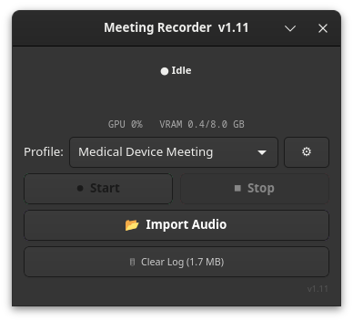
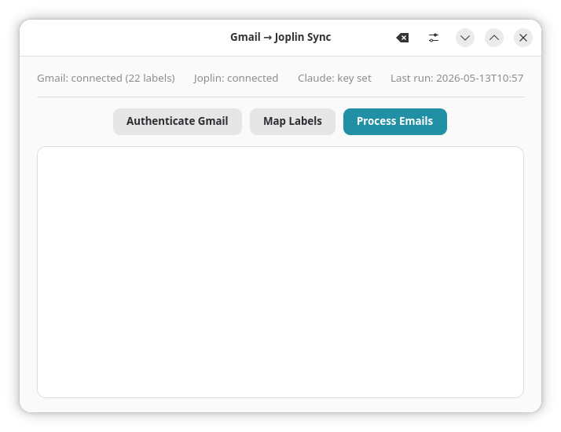
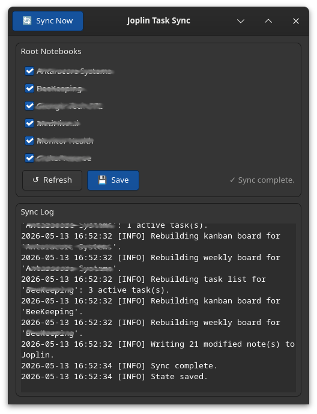

# Joplin Accessories

A collection of GTK4 productivity tools built around Joplin, designed for Fedora 43 / COSMIC desktop.

---

## Tools

| Tool | Platform | Description |
|---|---|---|
| [Meeting Recorder](#meeting-recorder) | Linux + Windows | GPU-accelerated transcription, AI summarization, and structured Joplin note creation |
| [Gmail → Joplin Sync](#gmail--joplin-sync) | Linux only | Sync Gmail threads to Joplin notebooks via Google OAuth2 |
| [Joplin Task Sync](#joplin-task-sync) | Linux only | Extract and sync tasks from Joplin meeting notes using Claude |

All three tools share the same `.env` file for API keys and write into Joplin via its Web Clipper REST API on `localhost:41184`.

---

## Prerequisites

### All tools
- Joplin desktop app running with Web Clipper enabled: Tools → Options → Web Clipper, port 41184
- Anthropic API key
- Joplin Web Clipper token (shown on the Web Clipper settings page)
- `sudo dnf install python3-gobject gtk4`

### Meeting Recorder (Linux only)
- NVIDIA GPU with CUDA 12.x installed
- HuggingFace token for faster-whisper model download
- `sudo dnf install ffmpeg`

### Meeting Recorder (Windows only)
- Python 3.11 or 3.12 — ctranslate2 4.7.1 does not support Python 3.14
- CUDA 12.x toolkit — CUDA 13.x will fail at runtime

### Gmail → Joplin Sync
- Google Cloud project with Gmail API enabled
- OAuth2 `credentials.json` downloaded from Google Cloud Console (Desktop app type)

### Joplin Task Sync
- **YesYouKan** Joplin plugin — required to render kanban boards. Install via Joplin: Tools → Options → Plugins → search "YesYouKan" → Install.

---

## Configuration

All three tools load API keys from a shared `.env` file at `~/Applications/MeetingGui/.env`. Each install script creates this file automatically on first run from `.env.example`. The file is excluded from version control.

```
ANTHROPIC_API_KEY=your_anthropic_api_key_here
JOPLIN_TOKEN=your_joplin_web_clipper_token_here
HF_TOKEN=your_huggingface_token_here
```

`HF_TOKEN` is only required by Meeting Recorder for the initial faster-whisper model download.

---

## Install All Tools

Run from the repo root:

```bash
chmod +x install_all.sh
bash install_all.sh
```

To install selectively:

```bash
bash install_all.sh meeting      # Meeting Recorder only
bash install_all.sh gmail        # Gmail → Joplin Sync only
bash install_all.sh tasks        # Joplin Task Sync only
bash install_all.sh gmail tasks  # Multiple tools
```

---

## Meeting Recorder



Records microphone and system audio simultaneously, transcribes via faster-whisper (large-v3, CUDA), summarizes via Claude, and saves structured notes directly to a Joplin notebook. Supports back-to-back job queuing, crash recovery, summary profiles, and live GPU monitoring.

### Install (Linux)
```bash
cd meeting-recorder/linux
bash install.sh
```

### Install (Windows)
```powershell
cd meeting-recorder\windows
.\install.ps1
```

### Summary Profiles
`profiles.json` ships with 5 built-in locked profiles. Custom profiles can be added via the UI.

| Profile | Description |
|---|---|
| Medical Device Meeting | Regulatory and technical meeting notes |
| Client Call | Client engagement summary |
| IP Assessment | Intellectual property review notes |
| LinkedIn Post (Standard) | General professional post |
| LinkedIn Post (Technical) | Technical audience post |

### Usage
1. Launch **Meeting Recorder** from the COSMIC app launcher.
2. Select a summary profile from the dropdown.
3. Select the target Joplin notebook.
4. Click **Start Recording**.
5. Click **Stop** when done — transcription and summarization run automatically.
6. The finished note appears in Joplin.

### Data Locations
| Platform | Path |
|---|---|
| Linux | `~/.local/share/meeting-recorder/` |
| Windows | `%APPDATA%\MeetingRecorder\` |

Pending jobs (WAV + JSON sidecars) are stored in the `pending/` subdirectory and survive crashes. On next launch the app detects and offers to resume them.

### Known Issues
- **Windows / CUDA:** ctranslate2 4.7.1 requires CUDA 12.x. CUDA 13.x will fail at runtime with a missing DLL error.
- **Windows / transcription hang:** If transcription stalls near completion, confirm `condition_on_previous_text=False` is set in `model.transcribe()`.
- **COSMIC launcher icon:** `StartupWMClass` in `.desktop` must exactly match the `application_id` set in `Gtk.Application`. After any edit run `update-desktop-database ~/.local/share/applications/`.
- **Speaker diarization:** pyannote.audio was evaluated and removed due to unresolvable telemetry hang issues.

---

## Gmail → Joplin Sync



Connects to Gmail via Google OAuth2 and syncs email threads to Joplin notebooks. Each thread becomes a structured note containing the subject, participants, date, body text, and a direct link back to Gmail. Label-to-notebook mapping is configured in the app UI. Processed thread state is tracked locally so threads are not duplicated on subsequent runs.

### Install
```bash
cd gmail-joplin-sync
bash install.sh
```

### First Run
1. Place your Google OAuth2 credentials file at `~/.config/gmail-to-joplin/credentials.json`. This file comes from Google Cloud Console → APIs & Services → Credentials → Download JSON (Desktop app type).
2. Launch **Gmail → Joplin Sync** from the COSMIC app launcher.
3. The status strip at the top shows connection state for Gmail, Joplin, and Claude.
4. Click **Authenticate Gmail** — your browser opens for the Google OAuth flow. Sign in and approve access. The token saves to `~/.config/gmail-to-joplin/token.json` and is reused on all future runs.
5. Click the **gear icon** (top-right) and paste your Joplin Web Clipper token.
6. Click **Map Labels** — assign a Joplin notebook to each Gmail label you want to sync. Check **Always** for labels you want pre-selected on every run.
7. Click **Process Emails** to run the sync.

### Resetting Sync State
To force all threads to reprocess on the next run, click the **clear icon** in the app header and confirm. This wipes `state.json` without touching your config or credentials. Alternatively:
```bash
echo '{"processed_threads": {}, "last_run": null}' > ~/.local/share/gmail-to-joplin/state.json
```

### Config & State Locations
| Path | Purpose |
|---|---|
| `~/.config/gmail-to-joplin/credentials.json` | Google OAuth2 client credentials — you place this |
| `~/.config/gmail-to-joplin/token.json` | OAuth2 access token — auto-generated on first auth |
| `~/.config/gmail-to-joplin/config.json` | Joplin token and label-to-notebook mappings |
| `~/.local/share/gmail-to-joplin/state.json` | Processed thread state |

### Troubleshooting
- **"Gmail: token invalid" on launch** — Delete `~/.config/gmail-to-joplin/token.json` and re-authenticate.
- **"Joplin: not reachable"** — Joplin desktop must be open with Web Clipper enabled before running the sync.
- **"Claude: NO KEY SET"** — `ANTHROPIC_API_KEY` is not set in `~/Applications/MeetingGui/.env`.
- **GTK4 import error on launch** — Run `sudo dnf install python3-gobject` — the `gi` module must come from dnf, not pip.
- **Thread body shows "(no plain-text body)"** — The sender used HTML-only email with no plain-text alternative. Attachments still list correctly and the Gmail link in the note provides full access.

---

## Joplin Task Sync



Scans Joplin meeting notes for action items using Claude and automatically generates two views per selected notebook: a flat **Task List** and a **Kanban Board**. Both are written as live Joplin notes that update every time a sync runs. Designed to run after Meeting Recorder sessions to keep follow-up items tracked without manual re-entry.

### Install
```bash
cd joplin-task-sync
bash install.sh
```

### How It Works
The app works at the root notebook level. You select which of your top-level Joplin notebooks to include in the roll-up (e.g. a client engagement notebook, a project notebook). For each selected root notebook, the sync:

1. Recursively scans all notes in that notebook and its sub-notebooks for action items and tasks.
2. Passes note content to Claude for task extraction — identifying owners, due dates, and source context.
3. Writes or updates two notes inside each root notebook:
   - **Task List** — a flat markdown list of all active tasks, grouped by source note, with links back to the originating meeting note.
   - **Kanban Board** — a kanban-formatted note rendered by the **YesYouKan** Joplin plugin, with tasks organized into columns (e.g. To Do, In Progress, Done), each card showing the task, due date, and source note link.

Task state is tracked between runs so tasks are not duplicated and completed items can be marked done. Root notebooks you want to exclude (Personal, Trash, etc.) are configurable in the UI settings panel.

### First Run
1. Launch **Joplin Task Sync** from the COSMIC app launcher.
2. The status strip confirms connectivity to Joplin and Claude.
3. Open **Settings** and confirm any root notebooks you want excluded from the roll-up.
4. Select the root notebooks to include using the notebook selector.
5. Click **Sync Tasks** — the app scans, extracts, and writes the Task List and Kanban Board notes into each selected notebook.
6. Open Joplin and navigate to any selected root notebook to see the generated views.

### Config & State Locations
| Path | Purpose |
|---|---|
| `~/Applications/MeetingGui/.env` | API keys shared with all tools |
| `~/.local/share/joplin-task-sync/` | Sync state and logs |

### Troubleshooting
- **"Joplin: not reachable"** — Joplin desktop must be open with Web Clipper enabled on port 41184.
- **Tasks not appearing** — Confirm the target notebook is not in the excluded root notebooks list in Settings.
- **Kanban board not updating** — Run sync again; the board note is fully rebuilt on every sync run.
- **COSMIC launcher icon not showing** — Run `update-desktop-database ~/.local/share/applications/` and log out and back in.

---

## License

MIT
